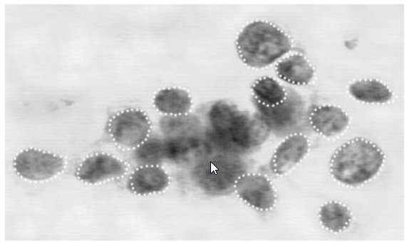
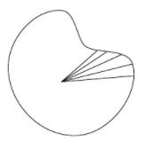
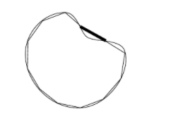
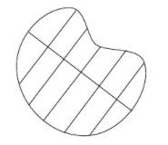
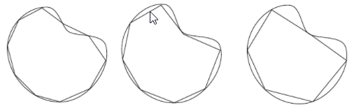

```{r load_libraries, include=FALSE}
# CARGA DE LIBRERIAS
# Librerias a cargar durante la generación del presente informe
PACKAGES <- c("dplyr", "ggplot2", "tidyverse", "reshape", "gridExtra", "psych", "sjmisc", "sjPlot", "sjstats")
# Install packages
inst <- match(PACKAGES, .packages(all=TRUE))
need <- which(is.na(inst))
if (length(need) > 0) install.packages(PACKAGES[need], repos = "http://cran.us.r-project.org")
# Load packages
lapply(PACKAGES, require, character.only=T)
```

> Enlace Github: https://github.com/JaimePerez89/PRAC2_Tipologia

# Detalles de la actividad

En esta práctica se elabora un caso práctico orientado a aprender a identificar los datos relevantes para un proyecto analítico y usar las herramientas de integración, limpieza, validación y análisis de las mismas.

Los objetivos concretos de esta práctica son: 

- Aprender a aplicar los conocimientos adquiridos y su capacidad de resolución de problemas en entornos nuevos o poco conocidos dentro de contextos más amplios o multidisciplinares. 
- Saber identificar los datos relevantes y los tratamientos necesarios (integración, limpieza y validación) para llevar a cabo un proyecto analítico. 
- Aprender a analizar los datos adecuadamente para abordar la información contenida en los datos. 
- Identificar la mejor representación de los resultados para aportar conclusiones sobre el problema planteado en el proceso analítico. 
- Actuar con los principios éticos y legales relacionados con la manipulación de datos en función del ámbito de aplicación. 
- Desarrollar las habilidades de aprendizaje que les permitan continuar estudiando de un modo que tendrá que ser en gran medida autodirigido o autónomo. 
- Desarrollar la capacidad de búsqueda, gestión y uso de información y recursos en el ámbito de la ciencia de datos.


# Descripción del dataset y objetivos del análisis

## Descripción dataset

La base de datos elegida contiene un total de 32 atributos de 569 muestras de tejidos afectados por cáncer de mama. Los atributos contienen información de las medias, desviaciones y de las medidas más desfavorables de una serie de características de las células cancerígenas.

Links descarga datasets:

> https://www.kaggle.com/uciml/breast-cancer-wisconsin-data?select=data.csv
> https://archive.ics.uci.edu/ml/datasets/Breast+Cancer+Wisconsin+%28Diagnostic%29
Las características de la base de datos se han calculado a partir de imágenes digitalizadas de muestras de tumores de mama. Describen las características de los núcleos celulares presentes en la imagen.

El procedimiento de toma de datos, de acuerdo a "W.N. Street, W.H. Wolberg and O.L. Mangasarian. Nuclear feature extraction for breast tumor diagnosis.", empieza por obtener a pequeña cantidad de fluido (masa) del tumor de mama utilizando una aguja fina (FNA). Para sacar las imágenes se expande ese material en un cristal y se toman imágenes utilizando una cámara JVC TK-1070U montada sobre un microscopio Olympus. Mediante el análisis de las imágenes se han obtenido diez características diferentes basadas en los límites de los núcleos celulares. Todas ellas son numéricamente modeladas de forma que a mayor valor, mayor probabilidad de ser maligno. Las características extraidas son:

- Radius: el radio de un núcleo individual se mide promediando la longitud de los segmentos de la línea radial definidos por el centroide de los "snakes" y los puntos individuales de los "snakes". [Nota: los Snakes son una serie de unidades basadas en contornos generadas durante el análisis de las imágenes]

<center>

{width='400px'}

</center>

- Perimeter: distancia total entre los puntos de los snakes que constituyen el núcleo del perímetro.
- Area: el área se es medido mediante el conteo del número de pixels en el interior del snake, añadiendo la mitad de los pixel del perímetro.
- Compactness: combinación del perímetro y del área para dar una medida de compactación utilizando la fórmula $perimeter^2/area$.
- Smoothness: la suavidad de un contorno nuclear se cuantifica midiendo la diferencia entre la longitud de la línea radial y la longitud media de las líneas que la rodean.

<center>

{width='200px'}

</center>

- Concavity: severidad de las cavidades o prominencias de las células de los núcleos.

<center>

{width='200px'}

</center>

- Concave Points: atributo similar al anterior pero que únicamente mide el número de prominencias en lugar de la magnitud de las mismas.
- Symmetry: simetría calculada en base a las diferencias entre las longitudes de las líneas ficticias perpendiculares al eje principales de la célula (el mayor)

<center>

{width='200px'}

</center>

- Fractal Dimension: la dimension fractal de una célula es aproximada mediante la "coastline approximation" descrita por Mandelbrot

<center>

{width='400px'}

</center>

- Texture: la textura de la célula es medida mediante la búsqueda de la varianza de las intensidades de la escala de grises de los píxeles que componen las imágenes.

- diagnosis: este atributo no ha sido obtenido del análisis de las imágenes. Identifica los tumores como malignos ("M") o benignos ("B"). Será el atríbuto clave de cara a entregar y a probar los algoritmos generados.


## Objetivos

El objetivo principal del análisis será la identificación de las variables que mejor determinen si las muestras de masas cancerígenas de mama se califican como malignas o benignas. Además, se procederá a la creación de modelos que permitan predecirlas en base a sus características y contrastes de hipótesis que permitan inferir propiedades interesantes en las muestras en futuras investigaciones.

Al tratarse de información muy crítica por referirse a la salud de personas, se realizará un estudio de los parámetros de los modelos que penalicen la identificación de tumores malignos como benignos, lo cual podría ser muy grave para la salud de los pacientes.


# Integración y selección de los datos de interés

## Lectura fichero y elementos vacios

En primer lugar, procedemos a lectura del fichero mediante la función read.csv.

```{r}
data_breast_cancer <- read.csv("./Data/breast_cancer.csv")
head(data_breast_cancer, 3)
```

En principio, según la información original de la base de datos, no se dispone de valores faltantes (NAs) en ninguno de sus atributos. Sin embargo, durante la lectura del archivo se observa que la función de lectura reconoce un atributo adicional "X" el cual si que contiene valores no disponibles. De cara a asegurarnos que no se han producido problemas adicionales, vamos a analizar el número total de NA para cada uno de los atributos.

```{r}
colSums(is.na(data_breast_cancer))
```

Comprobamos como la única variable que contiene valores perdidos es el atributo "X", el cual procedemos a eliminar de nuestra base de datos ya que se debe a un error en la lectura del archivo.

```{r}
data_breast_cancer <- data_breast_cancer %>% select(-X)
```

## Selección de datos de interés

La gran mayoría de las variables presentes en el conjunto de datos contiene información que no será relevante durante la creación de nuestros modelos. En concreto, para cada uno de los atributos descritos en el apartado anterior y debido a que son valores numéricos resultantes de un análisis de imagen previo, se proporcionan valores de media (XX_mean), desviación (XX_se) y el valor más desfavorable (XX_worst) durante su cálculo.

En nuestro caso, la variable que mejor nos identificará los núcleos tumorales será aquella que indica la media, por lo que procedemos a eliminar de nuestra base de datos el resto de variables:

```{r}
data <- data_breast_cancer %>% select(id, diagnosis, radius_mean, texture_mean, perimeter_mean, area_mean, smoothness_mean, compactness_mean, concavity_mean, concave.points_mean, symmetry_mean, fractal_dimension_mean)
```

Adicionalmente, podemos formatear los nombres de las variables para eliminar el apellido mean:

```{r}
names(data) <- c("id", "diagnosis", "radius", "texture", "perimeter", "area", "smoothness", "compactness", "concavity", "concave_points", "symmetry", "fractal_dimension")
head(data)
```


# Limpieza de datos

Como ya hemos analizado previamente, la base de datos no contiene "missing values". No obstante, antes de confirmar que se encuentra limpia, será necesario analizar aquellos datos que puedan no ser congruentes en comparación con el resto. Éstos son los denominados valores extremos o "outliers".

Para identificarlos el método más común es la utilización de los diagramas de cajas que analizan el rango intercuartílico de cada una de las variables de forma individual.

A continuación, vamos a representar de forma gráfica los boxplots de cada una de las variables identificando en color rojo aquellos valores susceptibles de ser considerados valores anómalos.

```{r}
plot1 <- data %>%
  ggplot(aes(y=radius)) + 
  geom_boxplot(outlier.colour="red", outlier.shape=8) + theme_bw()
plot2 <- data %>%
  ggplot(aes(y=texture)) + 
  geom_boxplot(outlier.colour="red", outlier.shape=8) + theme_bw()
plot3 <- data %>%
  ggplot(aes(y=perimeter)) + 
  geom_boxplot(outlier.colour="red", outlier.shape=8) + theme_bw()
plot4 <- data %>%
  ggplot(aes(y=area)) + 
  geom_boxplot(outlier.colour="red", outlier.shape=8) + theme_bw()
plot5 <- data %>%
  ggplot(aes(y=smoothness)) + 
  geom_boxplot(outlier.colour="red", outlier.shape=8) + theme_bw()
grid.arrange(plot1, plot2, plot3, plot4, plot5)
```


```{r}
plot1 <- data %>%
  ggplot(aes(y=compactness)) + 
  geom_boxplot(outlier.colour="red", outlier.shape=8) + theme_bw()
plot2 <- data %>%
  ggplot(aes(y=concavity)) + 
  geom_boxplot(outlier.colour="red", outlier.shape=8) + theme_bw()
plot3 <- data %>%
  ggplot(aes(y=concave_points)) + 
  geom_boxplot(outlier.colour="red", outlier.shape=8) + theme_bw()
plot4 <- data %>%
  ggplot(aes(y=symmetry)) + 
  geom_boxplot(outlier.colour="red", outlier.shape=8) + theme_bw()
plot5 <- data %>%
  ggplot(aes(y=fractal_dimension)) + 
  geom_boxplot(outlier.colour="red", outlier.shape=8) + theme_bw()
grid.arrange(plot1, plot2, plot3, plot4, plot5)
```


Comprobamos como para todas las variables se muestran valores remarcados en rojo, los cuales el boxplot identifica como outliers por encontrarse a una distancia mayor de 1,5 veces mayores que el rango intercuartílico de los correspondientes percentiles 0.25 y 0.75. De forma numérica, los valores detectados para cada una de las variables son:


```{r}
for(i in 3:12){
  calc <- boxplot.stats(data[,i])$out
  print(sprintf("Para la variable % s los outliers identificados son:", names(data)[i]))
  print(sprintf("% s", calc))
}
```

En base a la información gráfica y numérica de los valores extremos anteriores, aunque se detecten como valores outliers, no vamos a eliminarlos del análisis por considerarlos consistentes con el conjunto de los datos.


# Análisis de los datos

En primer lugar realizaremos un estudio de las estadísticas básicas de cada variable para, a continuación, comprobar la normalidad y la homogeneidad de la varianza de cada una de ella.

Posteriormente, realizaremos un análisis visual y responderemos a una serie de preguntas planteadas para generar información sobre la influencia de las variables en la clasificación de los tumores.

Por último, se procederá a la creación de modelos de regresión y clasificación con el objetivo de inferir la información contenido en la presente base de datos a futuras investigaciones que se realicen.


## Estadísticas básicas

La base de datos dispone de un total de `r nrow(data)` muestras identificadas cada una de ellas con un id único. Las estadísticas básicas del conjunto de datos son:

```{r}
summary(data[3:12])
```

En total se dispone de 357 muestras benignas y 212 muestras de tumos maligno.

```{r}
table(data$diagnosis)
```

Siendo las estadísticas particulares del grupo de tumores benignos:

```{r}
data %>% filter(diagnosis == "B") %>% select(-id, -diagnosis) %>% summary()
```

Mientras que las del grupo de tumores malignos son:

```{r}
data %>% filter(diagnosis == "M") %>% select(-id, -diagnosis) %>% summary()
```

De forma gráfica:

```{r}
data_graph <- melt(data, id=c("id","diagnosis"))
data_graph %>% ggplot(aes(x=diagnosis, y=value, fill=diagnosis)) + 
  geom_boxplot() + 
  facet_wrap(~ variable, scales = "free_y")
```


## Comprobación de la normalidad y homogeneidad de la varianza

Para el estudio de la normalidad procedemos a imprimir por pantalla los histogramas de cada una de las variables numéricas:

```{r}
data %>% select(-id, -diagnosis) %>% multi.hist(dcol = c("blue", "red"), dlty = c("dotted", "solid"), main = "")
```

Aunque no todas ellas siguen una distribución normal bien definidas (presentan singularidades en ciertos valores), en todos los casos nos encontramos con un número de muestras superior a 30, por lo que se puede considerar la aplicación del teorema del límite central (TLC) por el cual se estable que la hipótesis sobre la media $\overline{x}$ de una muestra se aproxima a una distribución normal aunque la población original no siga una distribución normal.

A continuación, pasamos a estudiar la homogeneidad de las varianzas. El supuesto de homogeneidad de varianzas, también conocido como supuesto de homocedasticidad, considera que la varianza es constante (no varía) en los diferentes niveles de un factor, es decir, entre diferentes grupos.

```{r include=FALSE}
library(car)
```


```{r warning=FALSE}
# Llevamos a cabo el test de Levene
# Radius
leveneTest(y = data$radius, group = data$diagnosis, center = "median")
# Texture
leveneTest(y = data$texture, group = data$diagnosis, center = "median")
# Perimeter
leveneTest(y = data$perimeter, group = data$diagnosis, center = "median")
# Area
leveneTest(y = data$area, group = data$diagnosis, center = "median")
# Smoothness
leveneTest(y = data$smoothness, group = data$diagnosis, center = "median")
# Compactness
leveneTest(y = data$compactness, group = data$diagnosis, center = "median")
# Concativity
leveneTest(y = data$concavity, group = data$diagnosis, center = "median")
# Concave points
leveneTest(y = data$concave_points, group = data$diagnosis, center = "median")
# Symmetry
leveneTest(y = data$symmetry, group = data$diagnosis, center = "median")
# Fractal dimension
leveneTest(y = data$fractal_dimension, group = data$diagnosis, center = "median")
```

Tras realizar el análisis de la homocedasticidad, queda reflejado que en las variables de el radio, el perímetro, el área, la compacidad, la concatividad, los puntos cóncavos y la dimensión fractal no cumplen dicho supuesto. Es decir, tras realizar el test de Levene dichas variables muestran diferencias significativas, por lo que hay diferencias entre las varianzas de las poblaciones de tumores malignos y benignos. Para nuestros posteriores análisis con la base de datos, vamos a realizar una regresión logística y varios modelos de ANOVA, así como la aplicación de un árbol de decisión. Para dichos métodos, el único que nos daría problemas es el ANOVA. Sin embargo, pese a que no se cumpla la homocedasticidad vamos a proceder a aplicar dicho método en vez de aplicar la alternativa no paramétrica, dada su alta robustez.


## Pruebas estadísticas

### Análisis univariante: ¿Qué variables influyen más en la peligrosidad del tumor?

En primer lugar, realizaremos un análisis univariante en el que se considerará cada variable por separado para ver si de forma independiente tiene efectos significativo sobre la malignidad del tumor. Para ello, realizaremos un test exacto de Fisher con el objetivo de ver si hay diferencias estadísticamente significativas entre ambas poblaciones.

```{r}
# Partimos la información en grupos
a <- data %>% filter(diagnosis == "B")
b <- data %>% filter(diagnosis == "M")
# Inicializamos un data.frame vacío para almacenar los datos
results <- data.frame()
# Realizamos los test para todas las variables
for(i in 3:12){
  results[i-2, 1] <- names(data[i])
  results[i-2, 2] <- var.test(a[,i], b[,i])$p.value
  
  if(results[i-2, 2] > 0.05){
    results[i-2, 3] = "NO"
  } else {
    results[i-2, 3] = "YES"
  }
}
names(results) <- c("Variable", "p-valor", "Diff significativa")
results
```

De acuerdo a los resultados del test, aquellas variables que no tienen una diferencia significativa entre la varianza de los dos grupos son:

- texture
- smoothness
- Symmetry
- fractal_dimension

Por el contrario, aquellas que sí que presentan una diferencia significativa entre los dos grupos son:

- radius
- perimeter
- area
- compactness
- concavity
- concave_points

### Análisis multivariante: ¿Qué variables influyen más en la peligrosidad del tumor?

A continuación, vamos a realizar un modelo en el que se incluyan todas las variables seleccionadas para la base de datos para ver qué influencia tienen en conjunto sobre la peligrosidad del tumor. Para dar respuesta a dicha pregunta, se utilizará un modelo de regresión logística:

```{r warning=FALSE}
# Creamos una variable numérica a partir de la variable diagnosis
data <- data %>% mutate(diagnosis, diag_num = ifelse(diagnosis == "B", 0, 1))

# Nombramos las filas para librarnos de la variable "id" y descartamos también la variable diagnosis anterior
row.names(data) <- data$id
data_model <- data %>% select(-id, -diagnosis)

# Creación del modelo
model <- glm(diag_num ~ scale(texture) + scale(radius) + scale(perimeter) + scale(area) + scale(smoothness) + scale(compactness) + scale(concavity) + scale(concave_points) + scale(symmetry) + scale(fractal_dimension), data = data_model, family = binomial)

tab_model(model, show.r2 = FALSE)
```

Como se puede observar, en el modelo en el que se incluyen todas las variables seleccionadas para ver cómo influyen sobre la variable respuesta, las variables que resultan significativas son:

- texture
- area
- smoothness
- concave_points

La significatividad estadística de dichas variables nos indica que:

- un mayor valor de la textura favorece de forma notoria que el diagnóstico del tumor sea maligno. 
- un mayor alor del área favorece de forma leve que el diagnóstico del tumor sea maligno. 
- la suavidad tiene un efecto muy importante favoreciendo la aparición del tumor maligno, presenta el valor de *odd ratio* más alto que 1.
- los puntos cóncavos también tiene una alta relevancia aumentando la probabilidad de que el tumor sea maligno: con una fuerte asociación positiva sobre la variable respuesta, ya que el valor se encuentra muy alejado del 1. 

### ¿Qué variables influyen sobre las variables que influyen sobre la peligrosidad del tumor?

Como hemos mencionado anteriormente, las variables que resultan significativas sobre la peligrosidad del tumor son la textura, el área, la suavidad y los puntos cóncavos. A continuación, vamos a ver qué variables influyen sobre estas variables llevando a cabo una prueba de ANOVA tomando como variable respuesta cada una de ellas y como variables explicativas las demás.

En primer lugar, analizaremos la variable de la textura:

```{r}
#Modelo texture
modelo_texture <- aov(texture ~ radius + perimeter + area + smoothness + compactness + concavity + concave_points + symmetry + fractal_dimension + diagnosis, data = data)
summary(modelo_texture)
```

Como se puede observar, las variables que resultan significativas sobre la la textura son el radio, el perímetro, la suavidad, la dimensión fractal y el diagnóstico.

A continuación, analizaremos la variable área:

```{r}
#Modelo area
modelo_area <- aov(area ~ texture + radius + perimeter + smoothness + compactness + concavity + concave_points + symmetry + fractal_dimension + diagnosis, data = data)
summary(modelo_area)
```

En este caso, las variables que resultan significativas son: la textura, el radio, el perímetro, la compacidad, la concavidad, la dimensión fractal y el diagnóstico.

Procederemos con el análisis de la variable suavidad.

```{r}
#Modelo smoothness
modelo_smoothness <- aov(smoothness ~ area + radius + perimeter + compactness + concavity + concave_points + symmetry + fractal_dimension + diagnosis, data = data)
summary(modelo_smoothness)
```

En este caso, las variables que resultan significativas son el area, el perímetro, la compacidad, los puntos cóncavos, la simetría y la dimensión fractal.

Por último, realizaremos el análisis de la variable puntos cóncavos. El análisis de dicha variable resutla de gran interés ya que, como hemos comentado anteriormente, es la variable que mayor influencia tiene sobre la malignidad del tumor.

```{r}
#Modelo puntos cóncavos
modelo_concave_points <- lm(concave_points ~ smoothness + area + radius + perimeter + compactness + concavity + symmetry + fractal_dimension + diagnosis, data = data)
summary(modelo_concave_points)
```

Para dicha variable, las variables que tienen influencia sobre ella son la suavidad, el perímetro, la concavidad y el diagnóstico.

### Clasificación con árbol de decisión

Los árboles de decisión son modelos de predicción que pueden usarse tanto para clasificación como regresión y cuyo funcionamiento se basa en la construcción de reglas lógicas (divisiones de los datos entre rangos o condiciones) a partir de los datos de entrada. En este caso, emplearemos dicha metodología con el objetivo de ver cómo de bien se predice un resultado benigno o maligno en función de las variables que hemos seleccionado en nuestra base de datos.

```{r}
#Reescalamos 
dataset <- data
dataset[, c(3:12)] <- scale(dataset[, c(3:12)])
#Creamos el training set y el test set
library(caTools)
set.seed(1234)
split <- sample.split(dataset$diagnosis, SplitRatio = 0.75)
training_set <- subset(dataset, split == TRUE)
test_set <- subset(dataset, split == FALSE)
#Aplicamos el método de árbol de decisión
library(rpart)
set.seed(1234)
clasificadorDT <- rpart(diagnosis ~ ., data = training_set)
pred_valid_DT <- predict(clasificadorDT, newdata = test_set, type = 'class')
matrizConfusion <- table(test_set$diagnosis, pred_valid_DT)
matrizConfusion
```

Al ver la matriz de confusión, observamos que se clasifican de forma correcta el 100% de los valores que se incluyen en el test set, tras entrenar el algoritmo con el training test. Por tanto, tendremos un 0% de error de predicción.

Al realizar la curva ROC:

```{r}
library(ROCR)
pred1 <- prediction(as.numeric(pred_valid_DT), test_set$diag_num)
perf1 <- performance(pred1, "tpr", "fpr")
plot(perf1)
```

Dichos números, quedan representados por la curva ROC, que demuestra el buen desempeño del clasificador para este conjunto de datos.

# Conclusiones

Tras el análisis que acabamos de realizar extraemos varias conclusiones. En primer lugar, por sí solas, las variables que influyen sobre la malignidad del tumor son el radio, el perímetro, el área, la compacidad, la concatividad y los puntos cóncavos. Al analizar las variables de forma conjunta, las variables que parecen tener un efecto significativo sobre el tipo de tumor son la textura, el área, la suavidad y los puntos cóncavos. Por último, el poder clasificatorio del tipo de tumor dadas las variables seleccionadas es del 100%.

# Contribuciones

Contribuciones durante la presente práctica:

 **Contribuciones**    |  **Firma** | 
-----------------------| ----------------------|
*Investigación previa* | Jaime Pérez & Ana Hubel 
*Redacción de las respuestas* | Jaime Pérez & Ana Hubel
*Desarrollo código* | Jaime Pérez & Ana Hubel
